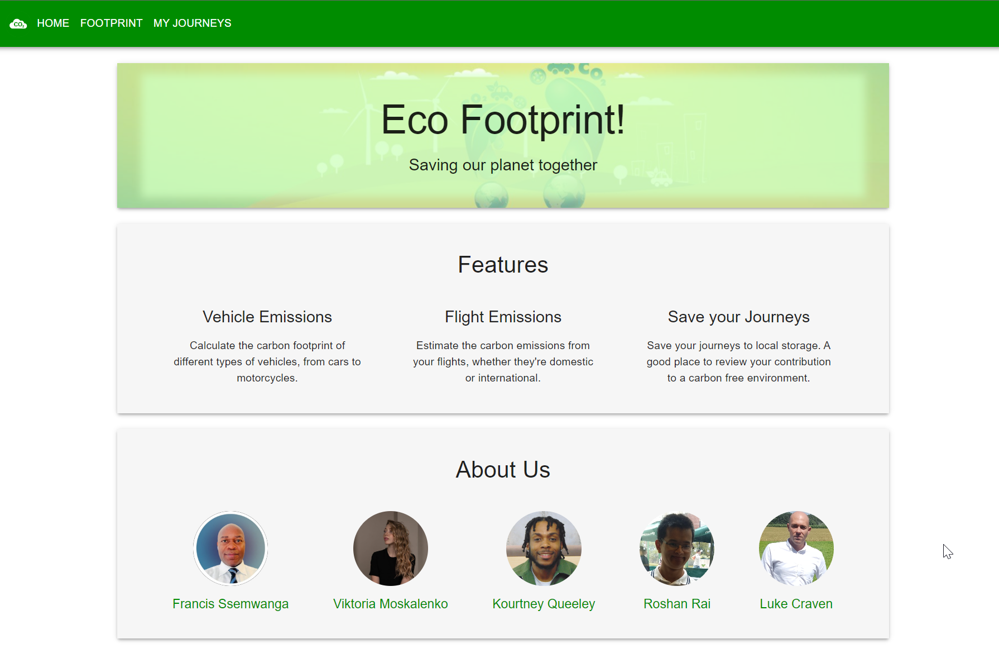
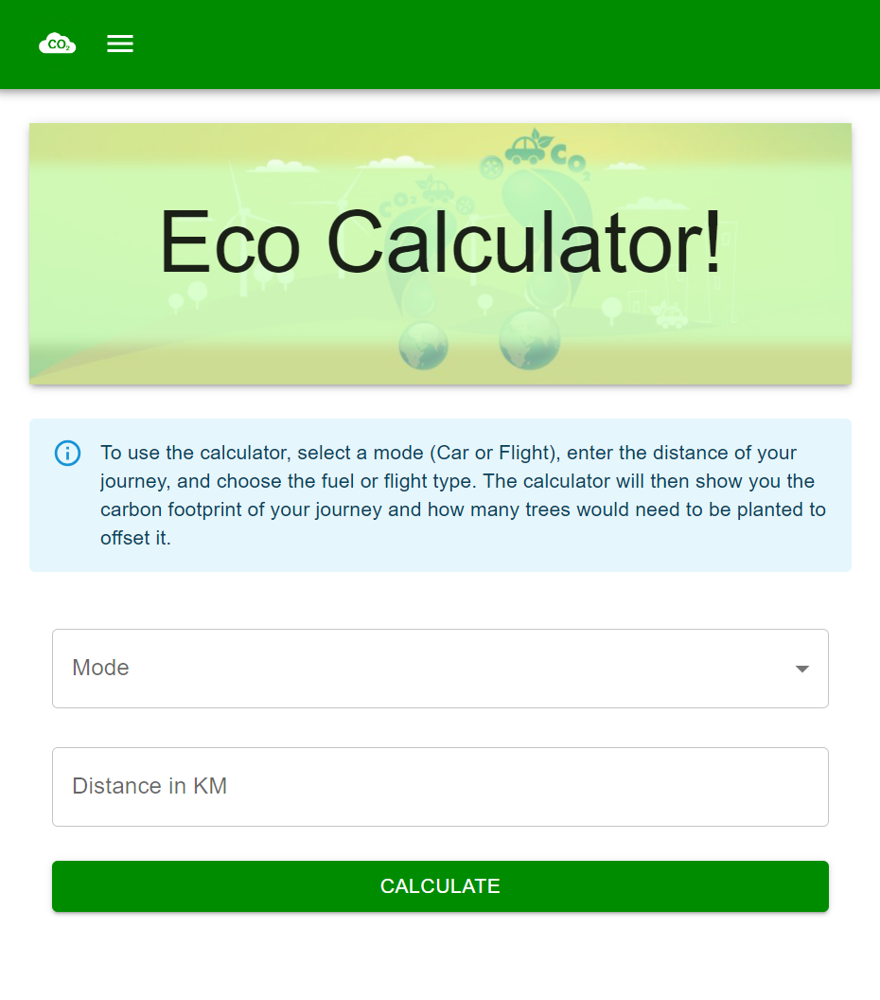

# Eco-Tracker

Eco-Tracker is a carbon footprint awareness project. It calculates carbon emissions using car /flight model and distance travelled and returns the carbon emissions and an equivalent number of trees to be planted.

---

## Content

- [Features](#features)
- [Getting Started](#getting-started)
- [Screenshots](#screenshots)
- [Technologies and Frameworks](#technologies-and-frameworks)
- [Contacts](#contacts)

---

## Features

- Calculate carbon emissions based on travel mode and distance.
- View the equivalent number of trees needed to offset emissions.
- Save favorite journeys to local storage.
- Delete unwanted journeys from local storage.

---

## Getting Started

```shell
git clone git@github.com:f-ssemwanga/eco-tracker.git
cd eco-tracker.git
npm install
npm run start
```

**_Environment Variable Setup_**

- Ensure you have a key from [RAPID API](https://rapidapi.com/)
- Copy the `.env.example` file to `.env` in the root of the project.
- Update the `.env` file with your API key

---

## Screenshots

### Desktop



### Mobile



---

## Technologies and Frameworks

- React
- React Router DOM
- MUI
- Axios
- Formik
- Yup

---

## Contacts:

- Francis Ssemwanga:[GitHub](https://github.com/f-ssemwanga) | [LinkedIn](https://www.linkedin.com/in/francis-ssemwanga-897a7112a/)
- Luke Craven: [GitHub](https://github.com/N20-Dev)
- Roshan Rai: [GitHub](https://github.com/LordNinth) | [LinkedIn](https://www.linkedin.com/in/roshan-rai-636191184/)
- Viktoria: [GitHub](https://github.com/Vikkk111) | [LinkedIn](https://www.linkedin.com/in/viktoriia-moskalenko-085376241/)
- Kourtney Queeley : [GitHub](https://github.com/Kourtneyq2) | [LinkedIn](https://www.linkedin.com/in/kourtney-queeley//)
